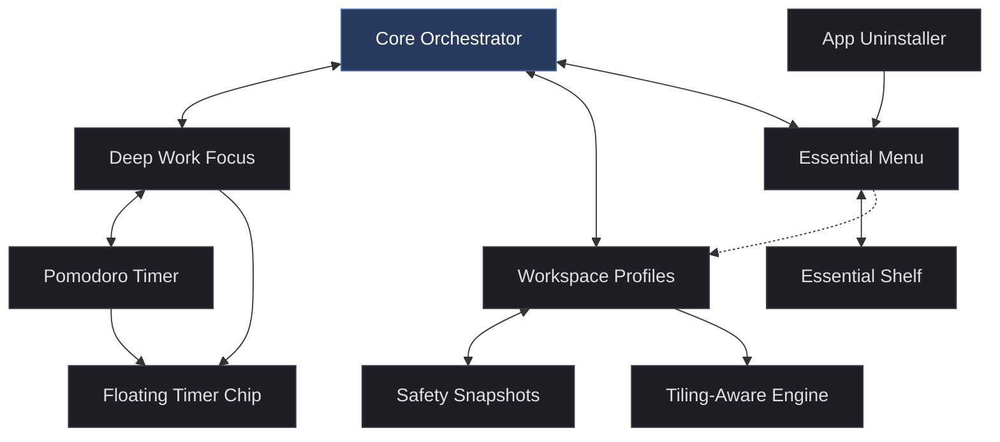

# GNOME Essentials

[](https://gnome.org)
[](LICENSE)

GNOME Essentials is a GNOME Shell extension for turning a busy desktop into a calmer, faster, more intentional workspace.

It is built for the small moments that decide whether your desktop feels helpful or noisy: starting a focused work session, reopening a complex layout, finding an app quickly, getting a useful battery reminder, or hiding the clutter around the window that actually matters.

GNOME already has a beautiful foundation. GNOME Essentials does not try to replace it. It adds the practical workflow layer that many people end up wishing GNOME had by default.

Some of these problems can be solved with separate extensions. GNOME Essentials exists because the day-to-day experience is different when the pieces are built to work together.

## Why This Extension Exists

Most desktop utilities solve one tiny problem in isolation. One extension hides the panel. Another manages windows. Another adds a launcher. Another handles focus timers. Over time the desktop becomes a pile of separate tools that do not understand each other.

GNOME Essentials takes a different approach. It treats the desktop as a complete working environment.

When you enter Deep Work, the timer, top panel, notification banners, ambient dimming, and floating controls should all agree about what is happening. When you save a workspace profile, the extension should understand both ordinary GNOME windows and tiling managers. When you open the launcher, it should be fast enough to become muscle memory.

The result is a set of desktop utilities that feel connected instead of bolted on.

### System Integration Map




## A Fair Word About Existing Extensions

GNOME has a generous extension ecosystem, and this project respects that. Several ideas in GNOME Essentials live in the same space as existing extensions: launchers, Pomodoro timers, panel hiding, notification helpers, window/session restore, battery reminders, and app uninstall shortcuts all have relatives in other projects.

GNOME Essentials is not presented as if every individual idea began here. That would be unfair to the GNOME community and to the people who have built useful tools before it. The purpose of this project is different: to turn a set of practical desktop habits into one coherent, maintained, GNOME-native workflow.

The hard part is the coordination. A focus timer should know when Deep Work is active. A hidden panel needs a usable control surface. A notification summary should only matter when notifications were actually suppressed. Workspace restore should not treat PaperWM or other tiling extensions like ordinary floating windows. The launcher, battery sounds, and uninstall utility should feel like they belong to the same desktop, not like unrelated parts pulled from different shelves.

If you already have a carefully tuned stack of separate extensions, that is valid. GNOME Essentials is for users who want fewer moving pieces, one settings surface, and features that are designed to cooperate from the beginning.

That is the promise of the project: not novelty for its own sake, but less friction every time you sit down to work.

## What You Get

- A Deep Work mode that can hide distractions, silence banners, dim the background, and keep your focused window clear.
- An integrated Pomodoro controller that can automatically enable Deep Work during focus and disable it during rest.
- A floating timer chip for controlling sessions while the real top panel is hidden.
- Workspace Profiles that save and restore real window layouts, including multi-window and multi-workspace setups.
- Workspace safety snapshots that can recover the previous layout after risky desktop transitions.
- Tiling-aware restore support for PaperWM, Tiling Shell, Tiling Assistant, gTile, and Forge.
- A centered Essential Menu launcher with app search, favorites, calculator, web search, file search, and Essential Shelf.
- Essential Shelf for explicitly keeping temporary files, folders, links, and small snippets nearby.
- Battery Health Sound reminders for healthy charging and low-battery moments.
- App uninstall shortcuts in the GNOME app grid and, optionally, inside Essential Menu.
- A clean Libadwaita settings window that keeps each feature discoverable.

## At a Glance

| Area | What it does |
| --- | --- |
| Deep Work Focus | Reduces visual and notification noise while you work |
| Pomodoro Timer | Runs focus/rest sessions and can control Deep Work automatically |
| Workspace Profiles | Saves and restores window layouts across workspaces |
| Essential Menu | Opens a fast centered launcher for apps, files, web search, calculations, and shelf items |
| Essential Shelf | Keeps selected files, folders, links, and snippets available from the launcher, with file previews when GNOME can provide them |
| Battery Health Sound | Plays useful battery threshold reminders through the desktop sound theme |
| App Uninstallation Utility | Adds convenient uninstall actions for installed applications |

## Compatibility

GNOME Essentials currently declares support for these GNOME Shell versions:

- GNOME 47
- GNOME 48
- GNOME 49
- GNOME 50
- GNOME 51

The extension is written for GNOME Shell and uses GJS, Libadwaita preferences, GSettings, and several Shell APIs. Some of the more advanced behavior also touches Shell internals, because GNOME does not expose stable public APIs for every desktop behavior this extension controls.

That is normal for ambitious GNOME Shell extensions, but it means new GNOME Shell releases should be tested carefully.

## Installation

### One-Line Install

You can install or update GNOME Essentials directly from GitHub with one command:

```bash
curl -fsSL https://raw.githubusercontent.com/ritesh-777/gnome-essentials/main/install.sh | bash
```

After installation, restart your GNOME Shell session.

On X11:

```text
Alt+F2 -> r -> Enter
```

On Wayland, log out and log back in.

Then enable the extension:

```bash
gnome-extensions enable gnome-essentials@ritesh
```

You can also enable it from Extensions Manager or GNOME Extensions.

Running the same one-line command again updates the extension to the latest version.

### Local Development Install

Clone the repository:

```bash
git clone https://github.com/ritesh-777/gnome-essentials.git
cd gnome-essentials
```

Run the installer:

```bash
./install.sh
```

When run from a local checkout, the installer compiles the GSettings schema and creates a development symlink at:

```text
~/.local/share/gnome-shell/extensions/gnome-essentials@ritesh
```

Restart GNOME Shell after installing.

On X11:

```text
Alt+F2 -> r -> Enter
```

On Wayland, log out and log back in.

Then enable the extension:

```bash
gnome-extensions enable gnome-essentials@ritesh
```

You can also enable it from Extensions Manager or GNOME Extensions.

### Updating

For a one-line GitHub install:

```bash
curl -fsSL https://raw.githubusercontent.com/ritesh-777/gnome-essentials/main/install.sh | bash
```

For a local development checkout:

```bash
git pull
./install.sh
```

Then restart GNOME Shell again. Recompiling schemas is important whenever settings are added or changed, and the installer already does that for you.

## Feature Tour

### Deep Work Focus

Deep Work Focus solves a modern desktop paradox: **while operating systems are designed to constantly pull your attention away with badges, notifications, and status indicators, focus requires sustained, uninterrupted concentration.** Every time a banner slides in or a background window updates, it costs cognitive energy to recover. 

Deep Work converts your desktop from a chatty environment into a quiet, single-focus workbench.

When enabled, Deep Work can:

- silence notification banners
- hide the top panel
- hide dock-style extensions where possible
- dim and blur background windows
- apply a stronger true ambient dimming mode
- keep the focused window clear
- coordinate with the integrated Pomodoro timer

The important part is that Deep Work is reversible. It captures the original shell state, applies the focus state, and restores the desktop when focus ends.

### Focus Levels

Deep Work has three visual suppression levels:

- Level 0: notification and dock suppression.
- Level 1: panel hiding plus ambient effects.
- Level 2: True Ambient Dimming for the strongest visual focus.

The level defines the overall intensity. Individual toggles let you decide exactly what should happen inside that level.

### Notification Silencing

GNOME Essentials can temporarily disable notification banners while Deep Work is active.

It does more than flip a setting once. It also watches notification banner actors and keeps suppression active if something tries to show banners during focus. When Deep Work ends, your previous notification banner state is restored.

If you use the Pomodoro notification summary feature, the timer can keep count of notifications that arrived while banners were silenced and remind you after the focus block ends.

### Panel and Dock Hiding

Deep Work can hide the top panel on the desktop and, optionally, inside the overview.

Panel hiding is handled carefully because hiding the actor alone is not enough. GNOME Shell can still reserve space for a hidden panel unless chrome tracking and work-area updates are handled. GNOME Essentials updates that reservation so windows can reclaim the top space.

It also includes extra handling for PaperWM, whose internal workspace layout can reserve top-bar space in its own way.

Dock hiding is best-effort and currently targets common dock-style extensions such as Dash to Dock and Dash to Panel where their state or actors can be detected safely.

### Ambient Dimming

Ambient Dimming is for reducing background noise without destroying the desktop context.

Soft ambient mode dims background windows and can apply blur, while the focused window remains fully visible.

True Ambient Dimming is stronger. It places a dark overlay below the focused window so everything around the current task feels subdued, similar in spirit to GNOME's own modal dimming during system dialogs.

If there is no focused window, the extension avoids applying the strongest focus overlay. The rule is simple: dim the surroundings only when there is a real focused target to protect.

### Integrated Pomodoro Timer

A focus timer sitting passively in your status bar does not protect your time—it just counts it. The real friction of time-blocking is the manual overhead: forgetting to silence your chat apps, toggle Do Not Disturb, or hide distracting background windows when focus begins, and forgetting to restore them when it is time to rest.

The Pomodoro timer in GNOME Essentials is an **active driver**. It automates the transition: when the focus block starts, your visual surroundings instantly quiet down. When rest starts, your desktop returns to normal, prompting you to step away without manual micro-management.

The timer supports:

- focus duration from 10 to 300 minutes
- rest duration from 5 to 180 minutes
- indefinite focus sessions
- automatic transition from focus to rest
- automatic transition from rest back to focus
- an optional auto-stop clock
- notification summary after focus
- optional notification count badge

The auto-stop clock is useful for hard stop times. When the system clock reaches the configured time, the timer resets, Deep Work turns off, and a notification explains what happened.

### Floating Timer Chip

Hiding the top panel is necessary for zero-distraction focus, but it creates a new problem: **how do you monitor your session, pause the clock, or track missed notifications without bringing back the entire noisy status bar?**

The Floating Timer Chip acts as a minimal, draggable control capsule. It stays out of your way, floating exactly where you place it. It gives you immediate access to your session time and notifications while keeping the rest of your system interface hidden, preserving your focus bubble.

The floating chip can:

- start and pause the timer
- reset the timer
- temporarily reveal the real top panel
- show the countdown
- show the system clock
- show a notification count badge
- switch between horizontal and vertical layout
- collapse into a smaller shape
- be dragged anywhere on screen
- remember its last monitor-relative position

The floating chip is only shown when it is needed: during an active timer session, outside the overview, and while the real panel is not being temporarily peeked.

### Workspace Profiles

Every time you switch context (e.g., from software development to writing documentation, or starting your morning routine), you waste time performing **"window Tetris"**: launching apps one by one, dragging them to specific monitors, snapping them side-by-side, and adjusting tiling layouts. This startup friction often leads to procrastination.

Workspace Profiles eliminates this overhead by **saving your entire desktop layout as a state**. With one click, it recreates your workspace layout: it moves windows to their correct workspaces and monitors, coordinates with tiling managers, launches missing applications, and focuses your primary window, returning you to your exact working context in seconds.

A saved profile includes:

- application id
- window class
- window title
- workspace index
- monitor index
- frame rectangle
- maximized state
- focused window state
- stacking information
- identity indexes for matching similar windows
- creation indexes for repeated app windows
- tiler-specific placement data when available

When applying a profile, GNOME Essentials first tries to match saved windows to windows that are already open. If auto-spawn is enabled, missing apps are launched and matched after they appear.

This means profiles can be used both as a layout switcher and as a session restorer.

### Workspace Safety Snapshots

Workspace Profiles also keeps one hidden safety snapshot called Previous Layout.

It is saved automatically before:

- applying a saved profile
- monitor layout changes
- screen lock or suspend

After the first safety snapshot exists, the Workspace Profiles panel menu shows a Restore Previous Layout action. It is intentionally simple: it does not create another visible profile, and it does not replace your saved profiles. It is there for the moments when a restore, monitor wake, or lock transition leaves the desktop in a layout you did not want.

### Tiling-Aware Restore

Normal GNOME Shell geometry is only part of the story. Tiling extensions often maintain their own layout models, and a simple `move_resize_frame` is not always enough.

GNOME Essentials currently targets:

- PaperWM
- Tiling Shell
- Tiling Assistant
- gTile
- Forge

For each supported tiler, the extension stores the placement information it can discover and tries to restore through the tiler's own model first.

If tiler-specific placement is missing or cannot be applied, GNOME Essentials falls back to normal GNOME Shell placement.

### PaperWM Profile Restore

PaperWM is handled with special care because the order in which windows open affects their final tile positions.

GNOME Essentials stores PaperWM column and row positions. During restore, it sorts launch order to rebuild the layout naturally, then runs a PaperWM reconciler that can adjust PaperWM's internal column arrays after windows have appeared.

It also handles vertical PaperWM stacks by placing lower windows under their saved anchor window when possible.

This is one of the most advanced parts of the extension. It exists because restoring a PaperWM layout properly requires more than reopening apps in the order they were originally launched.

### Default GNOME Restore

Workspace Profiles still works without a tiling extension.

The default fallback can:

- create missing workspaces
- move windows to the saved workspace
- move windows to the saved monitor
- restore maximized windows
- move and resize normal windows
- refocus the saved active window where possible

The fallback is deliberately conservative. It keeps the feature useful even when the desktop is running plain GNOME Shell.

### What Profiles Cannot Restore

Workspace Profiles restores window placement. It does not restore private application state.

For example, it can reopen or reposition a browser window, but it cannot guarantee that the browser returns to the exact scroll position of a web page after the window was closed. That state belongs to the browser.

The same is true for terminal processes, editor cursor locations, unsaved forms, in-app navigation history, and similar application-owned state.

### Essential Menu

Essential Menu is a centered launcher designed to be fast, visually calm, and useful from the keyboard.

It can be opened from:

- the top-panel icon
- the preferences window
- the optional `Super+Space` shortcut

The menu includes:

- favorite apps at the top
- all other apps below a separator
- application search
- calculator mode
- web search mode
- file search mode
- Essential Shelf mode
- optional backdrop dim
- optional animations
- light and dark styling

Search prefixes:

```text
= expression     Calculator
? query          Web search
~ query          File search
# query          Essential Shelf
```

Examples:

```text
= 12 * 8
? gnome shell extension development
~ project report
# meeting link
```

Calculator results can be copied with Enter. Web searches open in the default browser. File results open through the system default file handler.

File search uses GNOME LocalSearch when it is available on the system.

### Essential Shelf

The Essential Shelf is a temporary workbench inside Essential Menu designed to solve a common desktop friction: **where do you put files, links, and snippets that you only need for the next hour?**

Normally, users either clutter their physical desktop folder with temporary downloads, keep dozens of unrelated browser tabs open, or repeatedly navigate deep into file managers to access current files. The Shelf acts as an overlay scratchpad—a place to pin current working materials and discard them the moment the task is finished.

Key workflows where the Shelf becomes indispensable:
- **Active Task Contexts**: Keep a project's documentation link, a reference image, and a target folder pinned together in one place, accessible via keyboard from any workspace.
- **Intentional Clipboard**: Unlike passive clipboard history managers that capture everything (including passwords, tokens, and private chats), the Shelf only stores items you explicitly send to it.
- **Layout-Linked Launchers**: App items on the shelf don't just open a program; they carry document attachments and link directly to a Workspace Profile, letting you restore a complete working layout with a single click.

It is designed for things you want close at hand while moving between windows and workspaces:

- app launchers
- files
- folders
- links
- small text snippets
- paths you deliberately keep


Use `#` in Essential Menu to open Shelf mode. With an empty query, Shelf mode shows your saved work items first. When items exist, secondary actions appear below them for keeping the current clipboard text or clearing the shelf. With text after `#`, the menu offers to keep that text, link, path, or file URI and also filters existing shelf items.

File search results also include a compact keep action, so a file found with `~` can be held nearby without opening it first. Image files and files with cached GNOME thumbnails show previews; everything else falls back to the normal file or folder icon.

Application search results also include a keep action. App Shelf items store the desktop app ID, icon, and, when one is active, the current Workspace Profile name. They can also carry attached files, folders, links, and text notes. Clicking an app context launches the app, opens attached files and links, and, when the linked profile already contains that app, asks Workspace Profiles to restore that layout instead of inventing a second placement system.

This enables powerful developer and creator setups: **you can pin a single application (like VS Code) to your shelf and attach multiple project folder paths underneath it. Clicking that single app item on the shelf launches the application and opens all 3 or 4 project folders simultaneously in their own windows, automatically mapped to their correct screen layouts and workspaces.**

In Shelf mode, app attachments appear directly below their app context. The paperclip action on an app attaches the current clipboard text to that app. The paperclip action on a non-app Shelf item attaches it to the most recent app context.

Shelf mode also includes a Capture Current Workspace action. It saves the current layout as a Workspace Profile and stores it as a separate workspace context item in Shelf, using a workspace/grid icon rather than a single app icon. Captured workspace contexts can contain multiple app contexts. For apps whose open file can be inferred confidently from the window title and recent local files, such as office documents, PDF readers, text editors, and code editors, GNOME Essentials attaches that file under the matching app context. File manager windows can also capture a folder context when the visible folder title maps cleanly to a known user folder or recent-file parent folder. If the file or folder cannot be identified confidently, the app is still captured without a guessed attachment.

Some app contexts use app-specific open behavior. Browser app contexts open attached links in that browser. VS Code-style app contexts open attached folders and files through the editor command when it is available. Text editor contexts turn attached text notes into small files under GNOME Essentials data storage and open them in the editor. PDF and reading contexts such as Evince, Papers, Okular, MuPDF, Zathura, Xournal++, and Zotero open compatible PDF-like document files in the selected app. Office contexts such as LibreOffice, OnlyOffice, WPS Office, AbiWord, and Gnumeric open compatible document, spreadsheet, presentation, drawing, or database files in the selected app. Terminal contexts open attached folders as the working directory when the terminal supports it. Everything else keeps the generic fallback.

Shelf items can be opened, copied, revealed in Files when they point to a file or folder, removed individually, or cleared from preferences.

Essential Shelf also accepts external drops when GNOME Shell exposes the dropped URI or URL list. Drag selected files, folders, or links onto the Essential Menu panel icon to add them directly to Shelf; after a successful panel drop, the menu opens in Shelf mode so the added items are visible immediately. If the menu is already open, files can also be dropped onto the menu surface.

For systems where Shell drag payloads are restricted, preferences include a "Send to Essential Shelf" Nautilus script installer. After installing it, selected files and folders can be sent from Files through the right-click Scripts menu.

### Super+Space Shortcut

The optional `Super+Space` shortcut is intentionally off by default because GNOME often uses that shortcut for switching input sources.

If you enable it and a conflict is detected, GNOME Essentials shows a warning in preferences and provides a Resolve Conflict button. If the Essential Menu shortcut is later disabled, the preferences code attempts to restore `Super+Space` to GNOME's input-source shortcut list.

### Battery Health Sound

Modern lithium-ion batteries degrade rapidly if left plugged in at 100% charge for long periods, or if frequently drained to absolute zero. At the same time, standard operating system battery notifications are easy to miss, leading to unexpected shutoffs that destroy unsaved work.

Battery Health Sound provides **ambient acoustic feedback** at key thresholds (like 80% to unplug and preserve health, or 20% to plug back in). By using distinct audio cues from your desktop theme instead of silent banners, it keeps you aware of your power state without interrupting your visual flow, protecting both your hardware lifespan and your current session.

Default behavior:

- 100 percent: full charge reminder
- 80 percent: healthy upper charge reminder
- 20 percent: low battery reminder
- 10 percent and below: critical reminder with repeating alerts

The 10 percent critical reminder repeats with an interval that becomes shorter as the battery drops. The idea is not to be loud for its own sake, but to make truly low battery levels difficult to miss.

Options include:

- custom upper charge threshold
- custom low battery threshold
- full charge reminder toggle
- critical charge reminder toggle
- alert sound toggle
- desktop notification toggle
- Respect Do Not Disturb toggle

Sounds come from the current desktop sound theme. If a preferred sound event is not present, GNOME Essentials falls back through standard Freedesktop sound event names.

### App Uninstallation Utility

Modern Linux desktops package software in a mix of formats: Flatpaks, Snaps, native system packages (via APT/DNF/Pacman), and Web App/PWA launchers. Because of this fragmentation, removing an application usually requires opening a heavy software store, typing command-line instructions, or dealing with orphaned system dependencies and leftover configuration clutter inside your home directory.

The App Uninstallation Utility streamlines this into a **single, unified right-click action** from your GNOME app grid or launcher. It detects the package format, automates the correct terminal removal commands (requesting permissions only when system access is required), and handles leftover configuration caches to keep your system clean.

It tries to identify whether an app is:

- Flatpak
- Snap
- local desktop entry or PWA shortcut
- native system package

Depending on the type, removal may use Flatpak, Snap, or the system package manager. Native package removal can require authentication through `pkexec`.

This feature should be used with care. It is a convenience layer over real uninstall operations, not a toy action.

## Settings Window

GNOME Essentials includes a Libadwaita preferences window with three pages:

- Deep Work Focus
- Essential Tweaks
- Workspace Profiles

The preferences window is intended to make the extension understandable without requiring manual GSettings edits. Most runtime behavior can be changed from the UI.

## Project Structure

```text
extension.js
prefs.js
stylesheet.css
metadata.json
install.sh
schemas/
  org.gnome.shell.extensions.gnome-essentials.gschema.xml
modules/
  deepwork.js
  profiles.js
  tweaks.js
  tweaks/
    batteryHealthSound.js
    essentialMenu.js
    essentialShelf.js
    appUninstallUtility.js
```

### Runtime Modules

`extension.js` is the orchestrator. It watches feature settings and dynamically loads or unloads runtime modules.

`modules/deepwork.js` contains Deep Work, panel hiding, ambient dimming, notification suppression, and Pomodoro behavior.

`modules/profiles.js` contains Workspace Profiles, window matching, app launching, tiling metadata capture, and restore logic.

`modules/tweaks.js` manages the Essential Tweaks submodules.

`modules/tweaks/essentialMenu.js` contains the centered launcher.

`modules/tweaks/essentialShelf.js` contains Essential Shelf storage and item normalization.

`modules/tweaks/batteryHealthSound.js` contains UPower battery monitoring and sound alerts.

`modules/tweaks/appUninstallUtility.js` contains app-grid and launcher uninstall integration.

## GSettings Schema

The settings schema is:

```text
org.gnome.shell.extensions.gnome-essentials
```

The schema file is:

```text
schemas/org.gnome.shell.extensions.gnome-essentials.gschema.xml
```

After changing schema keys, compile schemas:

```bash
glib-compile-schemas schemas/
```

Then restart GNOME Shell.

## Development Notes

GNOME Essentials is written in GJS, GNOME Shell's JavaScript runtime.

It intentionally does not depend on external JavaScript packages. Runtime behavior is built around GNOME Shell, GLib, Gio, Clutter, St, Shell, Meta, and Libadwaita preferences.

Some features use private or semi-private Shell internals because GNOME Shell does not expose stable public APIs for every behavior involved. The most sensitive areas are:

- panel work-area reservation
- overview transition timing
- message tray banner actors
- PaperWM spaces and layout arrays
- tiling extension runtime objects
- GNOME app-grid context menus

When testing a new GNOME Shell release, these areas deserve the first pass.

## Contributing

Contributions are welcome. GNOME Essentials touches several parts of GNOME Shell, so the most helpful contributions are focused, tested, and clear about the desktop environment they were tested on.

Good contributions include:

- bug fixes with a short explanation of the cause
- compatibility updates for new GNOME Shell versions
- safer handling for Shell or tiling-extension internals
- UI polish that keeps the extension consistent with GNOME design language
- documentation improvements
- focused feature additions that fit the project philosophy

Before opening a pull request, please test the change in a real GNOME Shell session and include:

- GNOME Shell version
- session type, Wayland or X11
- distribution name and version
- enabled tiling extensions, if the change touches Workspace Profiles
- steps used to test the change
- relevant logs, if the issue involved Shell errors

Suggested workflow:

```bash
git clone https://github.com/ritesh-777/gnome-essentials.git
cd gnome-essentials
./install.sh
```

Then restart GNOME Shell and enable the extension:

```bash
gnome-extensions enable gnome-essentials@ritesh
```

For code changes, keep the patch narrow and avoid unrelated refactors. This is especially important in `modules/deepwork.js` and `modules/profiles.js`, where small changes can affect panel behavior, overview transitions, window matching, or tiling-manager restore logic.

Pull request flow:

1. Fork the repository.
2. Create a branch with a descriptive name.
3. Make the smallest change that solves the problem.
4. Test in GNOME Shell.
5. Open a pull request with screenshots or logs when they help explain the change.

## Practical Limitations

GNOME Essentials is powerful, but it is still bound by what GNOME Shell and applications expose.

- Workspace Profiles cannot restore private in-app state such as browser scroll position, terminal processes, editor cursor location, or unsaved form data.
- Tiling restore depends on the runtime internals of each tiling extension. If a tiling extension changes its internal API, compatibility may need to be updated.
- Battery sounds depend on UPower, desktop sound settings, and installed sound theme files.
- Essential Menu file search depends on GNOME LocalSearch.
- Essential Shelf stores references and text snippets. It does not copy file contents into its own storage.
- App uninstallation can invoke package managers and authentication prompts. Review what is being removed before confirming.
- Wayland users need to log out and back in after updates that require a Shell restart.

## Troubleshooting

### The extension does not appear

Check that the extension exists at:

```text
~/.local/share/gnome-shell/extensions/gnome-essentials@ritesh
```

Then restart GNOME Shell and enable it:

```bash
gnome-extensions enable gnome-essentials@ritesh
```

### New settings do not show up

Compile schemas again:

```bash
glib-compile-schemas schemas/
```

Then restart GNOME Shell or log out and back in.

### Essential Menu does not open with Super+Space

Make sure the shortcut is enabled in:

```text
GNOME Essentials Settings -> Essential Tweaks -> Essential Menu
```

If GNOME's Switch Input Source shortcut is still using `Super+Space`, use the conflict warning row in preferences to resolve it.

### Workspace Profiles restore apps but not the expected layout

Make sure the same tiling extension is enabled before restoring the profile.

If a profile was saved under one tiling manager and restored under another, GNOME Essentials will use whatever saved placement data still applies and then fall back to standard GNOME geometry.

For PaperWM, layout restore depends on window order, PaperWM space state, and the post-launch reconciler. Give newly launched apps a moment to appear before judging the final layout.

### Battery alerts do not make sound

Check these settings:

- Battery Health Sound is enabled.
- Play Alert Sound is enabled.
- Respect Do Not Disturb is not blocking sound while DND is active.

Also confirm that the system has usable desktop sound theme files.

## Philosophy

GNOME Essentials is built around a simple belief: the desktop should help you return to intent.

A good workspace is not only pretty. It remembers what you were doing. It gets quiet when you need quiet. It gives you controls when the normal controls are hidden. It lets you restart a working context without rebuilding everything by hand.

This extension is meant to make GNOME feel a little more prepared for serious daily work while still feeling like GNOME.

## License

GNOME Essentials is released under the GNU General Public License version 3.

See [LICENSE](LICENSE) for the full license text.

## Author

Created and maintained by Ritesh Seth.
